# 🏨 SMARTHotel Web Application

## 🌍 About IOT4Tunisia

**SmartHotel** is part of **IOT4Tunisia**, a year-long bootcamp running from **September 2020 to September 2021**, organized by [MentorNations](https://www.linkedin.com/company/mentornationstn) and sponsored by the **U.S. Embassy in Tunisia**. This initiative aimed to foster innovation through IoT and smart technologies by mentoring aspiring developers and engineers across Tunisia.

This web application is one component of a broader **IoT & Web** project designed for smart hotel experiences.

## 👥 Developed By

- Mahmoud Ben Abdelkader - [Github link](https://github.com/Mahmoud-ABK/)
- Mariem Zaghouani - [Github link](https://github.com/MariamZaghouani)
- Zaki Yousfi - [Github link](https://github.com/zakiyousfi)
- Hazar Hammouda - [Github link](https://github.com/HAZAR00)

## 🧰 Technologies Used

- **Angular** v12.1.1  
- **Angular CLI** v12.1.1  
- **Firebase SDK** v8.7.1 (via `@angular/fire` v6.1.5)  
- **Angular Material** v12.1.1  
- **Bootstrap** v5.0.2

## ⚠️ Compatibility Notice

> 🛠 This application was developed in **2021** using:
> - **Angular CLI v12**
> - **Node.js v14**

To ensure proper functionality, please use the matching versions during development or testing.

> ☁️ **Note:** The original cloud services (including Firebase backend) are currently **offline**. Authentication, data storage, and dynamic features depending on the backend will not function unless reconfigured with a valid Firebase project.

Make sure to install the appropriate versions when running the project to avoid compatibility issues.

---

## 🌐 Web Application Overview

**SmartHotel** is an intelligent hotel management web app that caters to three main user roles: **Guests**, **Staff**, and **Managers**. The system provides different interfaces, workflows, and login flows for each type of user.

### 🔑 Key Features

- **Guest Features**:
  - Online check-in and room customization
  - Access to personal guest profile and stay overview
  - Room service and food menu ordering

- **Manager Features**:
  - Admin dashboard with room management tools
  - Room reports and analytics
  - Room and service history archive

- **Staff Features**:
  - Kitchen and servant dashboards
  - Access to respective interfaces with secure login
  - Daily tasks and service management

- **Shared Features**:
  - Role-based login portal (roundabout login)
  - Password reset functionality
  - Responsive UI for both mobile and desktop
  - Integrated Firebase Authentication

---

## 📸 Photo Gallery

| Full View                             | Responsive View                              |
|--------------------------------------|----------------------------------------------|
| 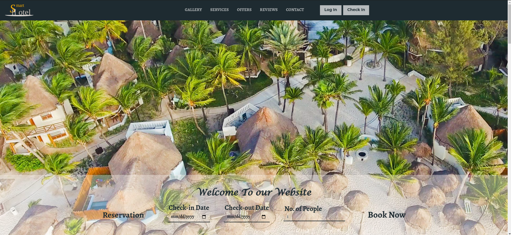        | 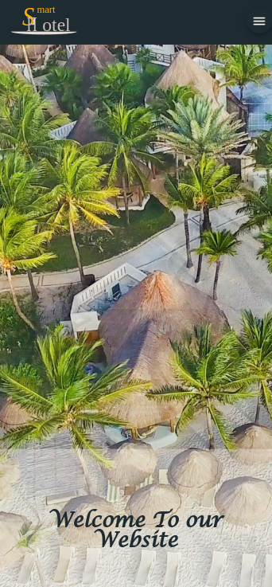        |
| 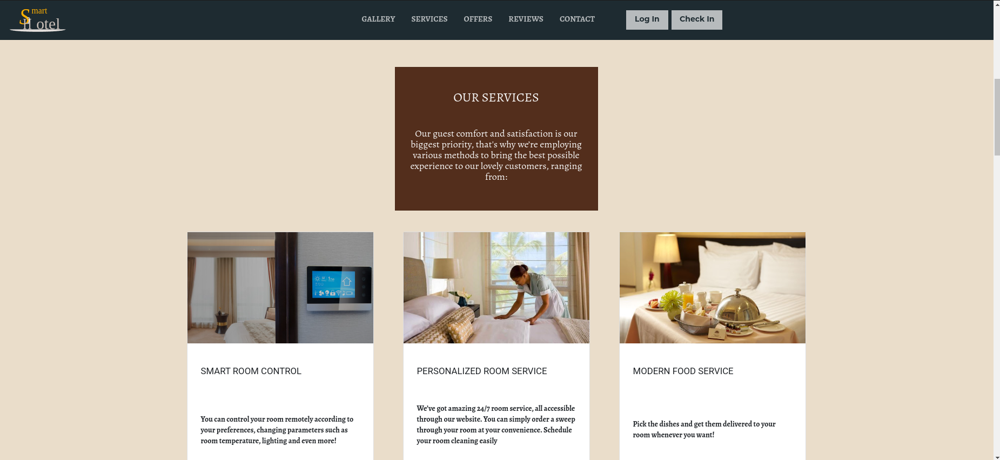     | 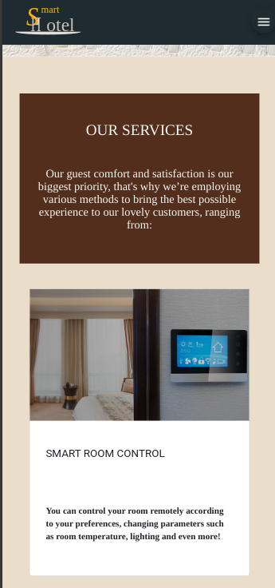     |
| 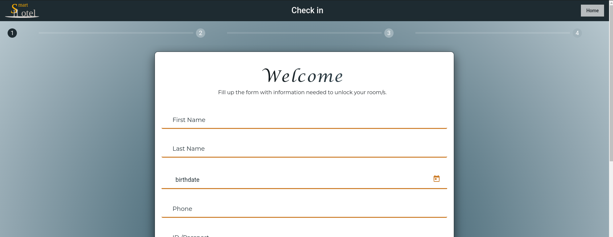 | 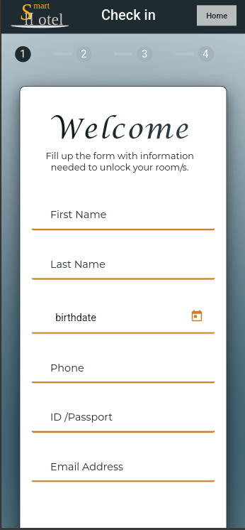 |
| 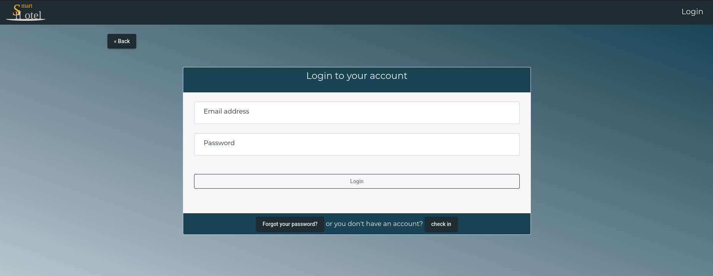      | 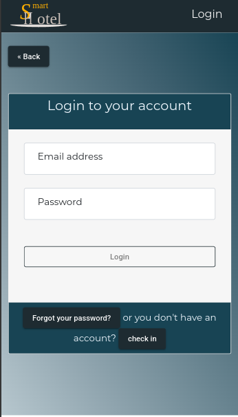      |
| 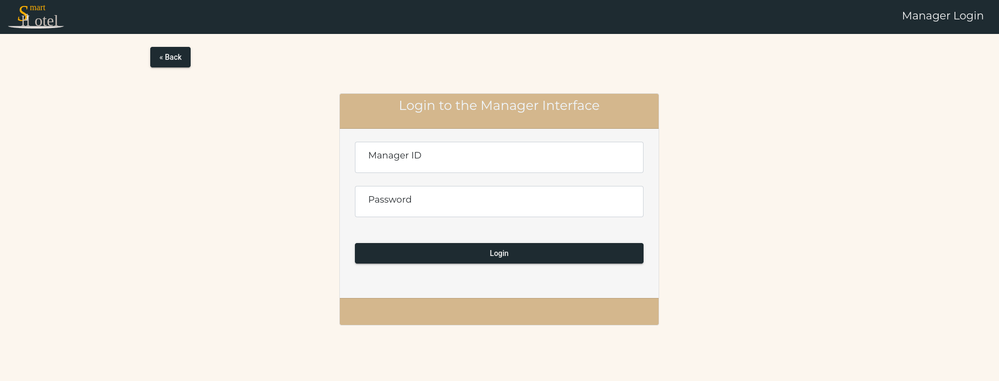 | 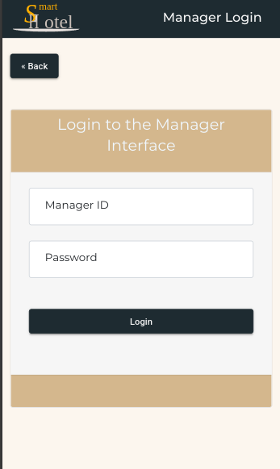 |
| 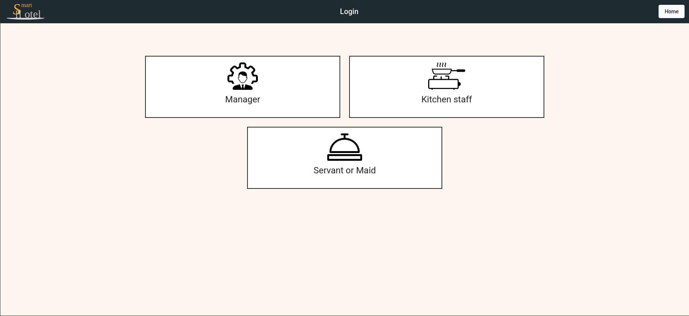          | 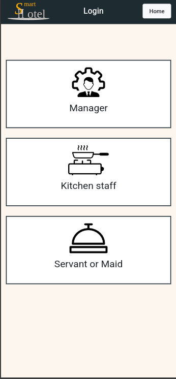          |
